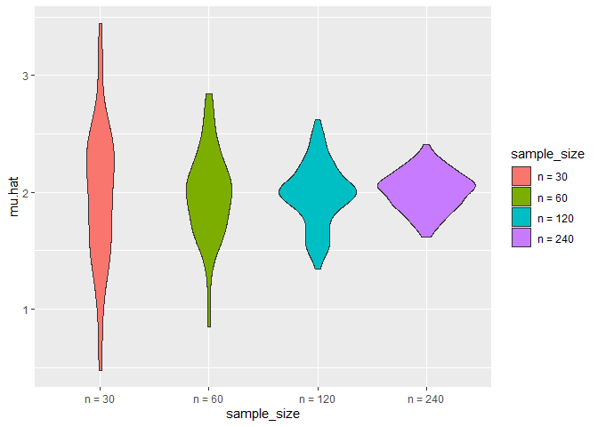

Simulation
================
Daniel Ojeranti
11/8/2020

# Lets simulate something

``` r
sim.mean.sd = function(n, mu = 2, sigma = 3) {
  
  sim_data = tibble(
    x = rnorm(n, mean = mu, sd = sigma),
  )
  
  sim_data %>% 
    summarize(
      mu.hat = mean(x),
      sigma.hat = sd(x)
    )
}

# I can simulate by running this
sim.mean.sd(30)
```

    ## # A tibble: 1 x 2
    ##   mu.hat sigma.hat
    ##    <dbl>     <dbl>
    ## 1   2.25      2.77

``` r
# simulating a lot
# Start with a for loop

output = vector("list", 100)

for (i in 1:100) {
  output[[i]] = sim.mean.sd(30)
}

sim.results = bind_rows(output)

# Lets use a loop function

sim.results = 
  rerun(100, sim.mean.sd(30, 2, 3)) %>% 
  bind_rows()


sim.results %>% 
  ggplot(aes(x = mu.hat)) + 
  geom_density()
```

<!-- -->

``` r
sim.results %>% 
  summarize(
   avg.samp.mean = mean(mu.hat),
   avg.samp.sd = sd(sigma.hat)
)
```

    ## # A tibble: 1 x 2
    ##   avg.samp.mean avg.samp.sd
    ##           <dbl>       <dbl>
    ## 1          1.99       0.375

``` r
sim.results %>% 
  pivot_longer(
    mu.hat:sigma.hat,
    names_to = "parameter", 
    values_to = "estimate") %>% 
  group_by(parameter) %>% 
  summarize(
    emp_mean = mean(estimate),
    emp_sd = sd(estimate)) %>% 
  knitr::kable(digits = 3)
```

    ## `summarise()` ungrouping output (override with `.groups` argument)

| parameter | emp\_mean | emp\_sd |
| :-------- | --------: | ------: |
| mu.hat    |     1.985 |   0.567 |
| sigma.hat |     2.971 |   0.375 |

# Trying other sample sizes

``` r
n.list = 
  list(
    "n_30"  = 30, 
    "n_60"  = 60, 
    "n_120" = 120, 
    "n_240" = 240
    )

output = vector("list", length = 4)

for (i in 1:4) {
  output[[i]] = 
    rerun(100, sim.mean.sd(n.list[[i]])) %>% 
    bind_rows()
}

sim.results = 
  tibble(sample_size = c(30, 60, 120, 240)) %>% 
  mutate(
    output_lists = map(.x = sample_size, ~ rerun(100, sim.mean.sd(n = .x))),
    estimate_dfs = map(output_lists, bind_rows)) %>% 
  select(-output_lists) %>% 
  unnest(estimate_dfs)
```

Do some data frame things

``` r
sim.results %>% 
  mutate(
    sample_size = str_c("n = ", sample_size),
    sample_size = fct_inorder(sample_size)) %>% 
  ggplot(aes(x = sample_size, y = mu.hat, fill = sample_size)) + 
  geom_violin()
```

<!-- -->

``` r
sim.results %>% 
  pivot_longer(
    mu.hat:sigma.hat,
    names_to = "parameter", 
    values_to = "estimate") %>% 
  group_by(parameter, sample_size) %>% 
  summarize(
    emp_mean = mean(estimate),
    emp_var = var(estimate)) %>% 
  knitr::kable(digits = 3)
```

    ## `summarise()` regrouping output by 'parameter' (override with `.groups` argument)

| parameter | sample\_size | emp\_mean | emp\_var |
| :-------- | -----------: | --------: | -------: |
| mu.hat    |           30 |     1.969 |    0.354 |
| mu.hat    |           60 |     1.979 |    0.143 |
| mu.hat    |          120 |     1.982 |    0.071 |
| mu.hat    |          240 |     2.014 |    0.027 |
| sigma.hat |           30 |     3.001 |    0.157 |
| sigma.hat |           60 |     2.952 |    0.053 |
| sigma.hat |          120 |     2.975 |    0.032 |
| sigma.hat |          240 |     3.018 |    0.014 |
