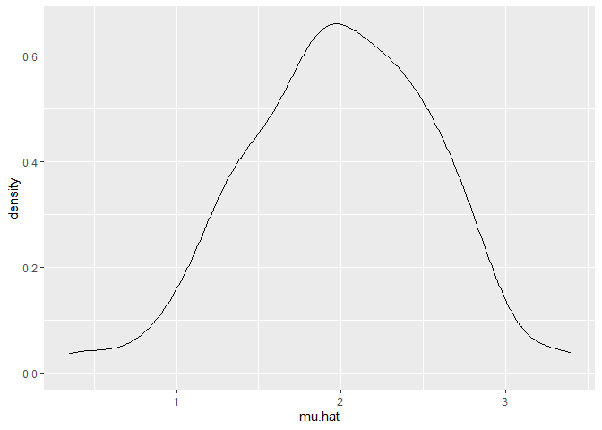

Simulation
================
Daniel Ojeranti
11/8/2020

# Lets simulate something

``` r
sim.mean.sd = function(n, mu = 2, sigma = 3) {
  
  sim_data = tibble(
    x = rnorm(n, mean = mu, sd = sigma),
  )
  
  sim_data %>% 
    summarize(
      mu.hat = mean(x),
      sigma.hat = sd(x)
    )
}

# I can simulate by running this
sim.mean.sd(30)
```

    ## # A tibble: 1 x 2
    ##   mu.hat sigma.hat
    ##    <dbl>     <dbl>
    ## 1   2.25      2.77

``` r
# simulating a lot
# Start with a for loop

output = vector("list", 100)

for (i in 1:100) {
  output[[i]] = sim.mean.sd(30)
}

sim.results = bind_rows(output)

# Lets use a loop function

sim.results = 
  rerun(100, sim.mean.sd(30, 2, 3)) %>% 
  bind_rows()


sim.results %>% 
  ggplot(aes(x = mu.hat)) + 
  geom_density()
```

<!-- -->

``` r
sim.results %>% 
  summarize(
   avg.samp.mean = mean(mu.hat),
   avg.samp.sd = sd(sigma.hat)
)
```

    ## # A tibble: 1 x 2
    ##   avg.samp.mean avg.samp.sd
    ##           <dbl>       <dbl>
    ## 1          1.99       0.375

``` r
sim.results %>% 
  pivot_longer(
    mu.hat:sigma.hat,
    names_to = "parameter", 
    values_to = "estimate") %>% 
  group_by(parameter) %>% 
  summarize(
    emp_mean = mean(estimate),
    emp_sd = sd(estimate)) %>% 
  knitr::kable(digits = 3)
```

    ## `summarise()` ungrouping output (override with `.groups` argument)

| parameter | emp\_mean | emp\_sd |
| :-------- | --------: | ------: |
| mu.hat    |     1.985 |   0.567 |
| sigma.hat |     2.971 |   0.375 |
